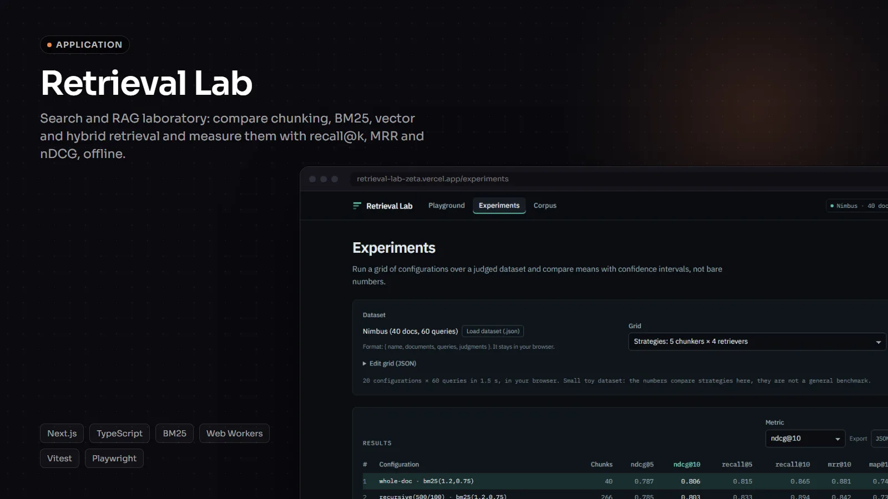
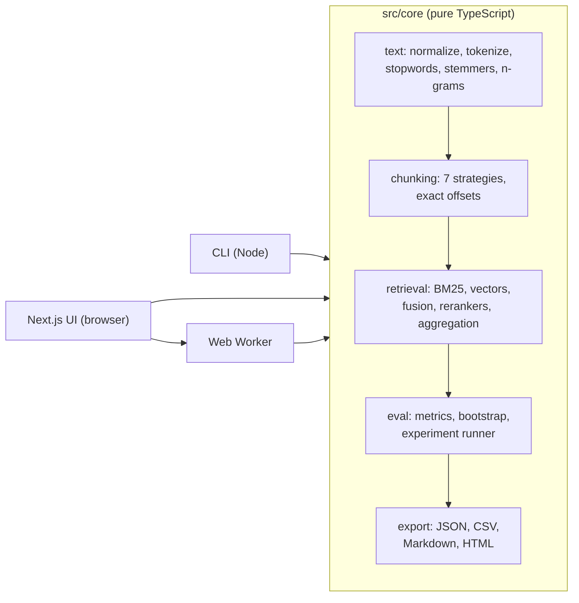

# Retrieval Lab



**Live demo:** https://retrieval-lab-zeta.vercel.app

**A search and RAG laboratory: compare chunking, BM25, vector and hybrid retrieval, and measure them with recall@k, MRR and nDCG. Runs fully offline, no API key.**

[Português](README.pt-BR.md) · [Architecture](docs/ARCHITECTURE.md) · MIT

Most RAG demos are a chat box. Whether the answer is any good is mostly decided one step earlier, by
**retrieval**: which chunks reach the model. Retrieval Lab is about measuring that step. It chunks a
corpus several ways, retrieves with BM25, vectors or both, reranks, and scores every configuration
against graded relevance judgments, with confidence intervals and a paired significance test so a
0.01 difference is not mistaken for progress.

Everything is a pure TypeScript core with zero runtime dependencies besides `zod`, used by a CLI and by
a Next.js app that computes everything in your browser (no backend, no database, no API key).

| Playground                                                                  | Experiments                                                                  | Corpus                                            |
| --------------------------------------------------------------------------- | ---------------------------------------------------------------------------- | ------------------------------------------------- |
|  |  |  |

## What is inside

- **Text analysis**: Unicode NFKD accent folding, tokenizer with exact offsets, pt-BR and en
  stopwords, light suffix-stripping stemmers for both languages, word and character n-grams,
  sentence splitter.
- **Chunkers** (all return exact `start`/`end` offsets, property-tested): whole document, fixed
  characters, fixed tokens, sentence-packing, paragraph, markdown heading-aware (with heading path) and
  a LangChain-style recursive splitter, each with optional overlap.
- **Retrievers**: Okapi BM25 over an inverted index (`k1`, `b` configurable); exact cosine vector search
  behind an `Embedder` interface; a deterministic, training-free `HashingEmbedder` (signed feature
  hashing of word uni/bigrams and character trigrams) so everything works offline; and an
  `OpenAICompatibleEmbedder` for any `/embeddings` endpoint (OpenAI, Ollama, LM Studio, vLLM...).
- **Hybrid and reranking**: Reciprocal Rank Fusion, weighted min-max fusion, MMR for diversity and a
  transparent lexical reranker (query-term coverage and proximity). The rerankers are heuristics, not
  neural cross-encoders, and are labelled as such everywhere.
- **Evaluation**: zod-validated datasets with graded judgments; recall@k, precision@k, hit@k, MRR, MAP
  and graded nDCG@k; percentile-bootstrap confidence intervals; paired bootstrap to answer "is B
  better than A?"; per-query diagnosis (why a query failed); exports to JSON, CSV, Markdown and a
  self-contained HTML report.
- **Bundled dataset**: an original bilingual corpus about Nimbus, a fictional developer platform: 40
  documents (20 pt-BR, 20 en, from 500 to 6,200 characters, some long runbooks with headings) and 60
  queries with graded judgments, including paraphrases, queries without accents, queries in the other
  language, typos and multi-document questions. See [datasets/nimbus](datasets/nimbus/README.md).
- **CLI**: `search`, `eval` and `chunk` with readable tables, `--json`, exit codes and `--help`.
- **Web UI** (pt-BR and en, state in the URL):
  - _Playground_: query a corpus, tune the strategy, see highlighted matches, where each chunk sits in
    its document, and each result's BM25 / vector / fusion / rerank breakdown and rank changes.
  - _Experiments_: run a grid in a Web Worker, compare configurations on any metric with CIs, ask
    "is B better than A?", break results down by query type and drill into a per-query heatmap.
  - _Corpus_: browse documents and see exactly where each chunker cuts (overlaps hatched), or bring
    your own corpus by pasting text or loading `.md`, `.txt`, `.jsonl` or a dataset `.json`. It never
    leaves the browser.

## Quick start

Requires Node 22 or newer.

```bash
npm install --no-audit --no-fund
npm run dev                # http://localhost:3120 (redirects to /pt-BR; /en for English)
```

CLI (via `tsx`, no build step):

```bash
npm run rlab -- search "verify webhook signature" --retriever hybrid --k 5
npm run rlab -- search "como faco rotacao de chave" --retriever bm25 --rerank lexical --chunker markdown
npm run rlab -- chunk datasets/nimbus/docs/deployments-guide.md --chunker recursive --size 600 --overlap 100 --preview
npm run rlab -- eval --dataset datasets/nimbus.json --grid datasets/grid.default.json --out reports/nimbus --format md,json,csv,html
npm run experiment         # the same eval, with the default grid
npm run rlab -- --help
```

`--corpus` accepts a directory of `.md`/`.txt` files, a single `.md`/`.txt`/`.jsonl` file or a
dataset `.json`. Exit codes: 0 success, 1 runtime error, 2 invalid usage.

## Results on the bundled dataset

Produced by `npm run experiment` (default grid: 5 chunkers × 4 retrievers, document-level metrics, max aggregation, 2,000 bootstrap resamples, seed 42). **These numbers come from the small bundled toy dataset. They are not a general benchmark** and would move with different documents, queries or judgments.

| #   | configuration                         | chunks | ndcg@5 |    **ndcg@10** (95% CI) | recall@5 | recall@10 | mrr@10 | map@10 |
| --- | ------------------------------------- | -----: | -----: | ----------------------: | -------: | --------: | -----: | -----: |
| 1   | whole-doc · bm25(1.2,0.75)            |     40 |  0.787 | **0.806** (0.735–0.870) |    0.815 |     0.865 |  0.881 |  0.741 |
| 2   | recursive(500/100) · bm25(1.2,0.75)   |    266 |  0.785 | **0.803** (0.739–0.862) |    0.833 |     0.894 |  0.842 |  0.731 |
| 3   | chars(500/100) · bm25(1.2,0.75)       |    254 |  0.790 | **0.802** (0.733–0.865) |    0.825 |     0.856 |  0.860 |  0.733 |
| 4   | whole-doc · hybrid(w0.5)              |     40 |  0.769 | **0.792** (0.720–0.858) |    0.804 |     0.853 |  0.863 |  0.719 |
| 5   | recursive(500/100) · hybrid(w0.5)     |    266 |  0.751 | **0.788** (0.723–0.849) |    0.797 |     0.914 |  0.858 |  0.729 |
| 6   | recursive(500/100) · hybrid(rrf60)    |    266 |  0.745 | **0.788** (0.721–0.850) |    0.778 |     0.910 |  0.866 |  0.734 |
| 7   | chars(500/100) · hybrid(w0.5)         |    254 |  0.759 | **0.785** (0.719–0.849) |    0.781 |     0.869 |  0.864 |  0.714 |
| 8   | sentence(500) · bm25(1.2,0.75)        |    230 |  0.780 | **0.785** (0.715–0.847) |    0.833 |     0.868 |  0.850 |  0.727 |
| 9   | chars(500/100) · hybrid(rrf60)        |    254 |  0.754 | **0.780** (0.709–0.850) |    0.775 |     0.844 |  0.862 |  0.717 |
| 10  | whole-doc · hybrid(rrf60)             |     40 |  0.751 | **0.777** (0.710–0.841) |    0.787 |     0.869 |  0.866 |  0.721 |
| 11  | sentence(500) · hybrid(w0.5)          |    230 |  0.745 | **0.771** (0.700–0.840) |    0.789 |     0.872 |  0.865 |  0.707 |
| 12  | sentence(500) · hybrid(rrf60)         |    230 |  0.727 | **0.766** (0.694–0.834) |    0.750 |     0.879 |  0.871 |  0.712 |
| 13  | markdown(800) · bm25(1.2,0.75)        |    250 |  0.755 | **0.764** (0.694–0.832) |    0.833 |     0.872 |  0.815 |  0.697 |
| 14  | markdown(800) · hybrid(rrf60)         |    250 |  0.720 | **0.751** (0.684–0.814) |    0.793 |     0.883 |  0.839 |  0.695 |
| 15  | markdown(800) · hybrid(w0.5)          |    250 |  0.731 | **0.747** (0.675–0.814) |    0.807 |     0.862 |  0.835 |  0.687 |
| 16  | chars(500/100) · vector(hash1024)     |    254 |  0.717 | **0.744** (0.667–0.812) |    0.750 |     0.831 |  0.833 |  0.673 |
| 17  | recursive(500/100) · vector(hash1024) |    266 |  0.708 | **0.730** (0.649–0.803) |    0.753 |     0.821 |  0.813 |  0.666 |
| 18  | sentence(500) · vector(hash1024)      |    230 |  0.703 | **0.724** (0.642–0.804) |    0.725 |     0.790 |  0.849 |  0.667 |
| 19  | whole-doc · vector(hash1024)          |     40 |  0.690 | **0.714** (0.640–0.785) |    0.737 |     0.804 |  0.818 |  0.637 |
| 20  | markdown(800) · vector(hash1024)      |    250 |  0.668 | **0.692** (0.615–0.765) |    0.729 |     0.808 |  0.800 |  0.633 |

Paired bootstrap on nDCG@10 (10,000 resamples), all with `recursive(500/100)` chunks unless stated:

| Comparison (B vs A)                                  | Δ nDCG@10 |          95% CI | B won / lost / tied | Verdict         |
| ---------------------------------------------------- | --------: | --------------: | ------------------: | --------------- |
| whole-doc BM25 vs recursive BM25 (best vs runner-up) |    +0.003 | [−0.035, 0.041] |        16 / 17 / 27 | noise           |
| BM25 vs hashing vector                               |    +0.074 |  [0.013, 0.138] |        24 / 15 / 21 | distinguishable |
| hybrid RRF vs BM25                                   |    −0.015 | [−0.056, 0.023] |        17 / 17 / 26 | noise           |
| recursive(500/100) vs markdown(800), both BM25       |    +0.040 |  [0.007, 0.076] |         18 / 9 / 33 | distinguishable |

nDCG@10 by query type (a query can have several tags):

| Query type (n)     | BM25 | hashing vector | hybrid RRF | hybrid weighted |
| ------------------ | ---: | -------------: | ---------: | --------------: |
| keyword (18)       | 0.94 |           0.85 |       0.95 |            0.92 |
| paraphrase (17)    | 0.60 |           0.60 |       0.63 |            0.62 |
| cross-lingual (10) | 0.64 |           0.41 |       0.54 |            0.56 |
| long-doc (10)      | 0.87 |           0.89 |       0.87 |            0.87 |
| no-accents (8)     | 0.78 |           0.64 |       0.72 |            0.75 |
| multi-doc (4)      | 0.92 |           0.89 |       0.89 |            0.90 |
| morphology (3)     | 0.86 |           0.97 |       0.87 |            0.87 |
| typo (3)           | 0.83 |           0.62 |       0.78 |            0.81 |

How to read this honestly:

- On this corpus **BM25 is hard to beat**. The top configurations are within about 0.01 nDCG@10 of each other and their intervals overlap heavily; the paired test cannot tell the best from the runner-up.
- The offline hashing embedder alone is measurably worse than BM25 here (the CI of the delta excludes zero). It is a lexical/sub-word model, so this is expected, not a verdict on dense retrieval with a real model.
- Hybrid fusion does not improve nDCG@10 on average, though it reaches the highest recall@10 (0.914 / 0.910). Paraphrases score about 0.6 for every method: none of them understands meaning, which is exactly the gap a semantic embedding model would address.
- The markdown chunker with 800 characters loses to the recursive splitter with overlap on this data, by a margin the paired test separates from noise.
- Groups with 3 or 4 queries (typo, morphology, multi-doc) are far too small to conclude anything.

## Architecture



The core has no React, DOM or Node imports (an ESLint rule enforces it), so the exact same code runs
in tests, in the CLI and in the browser. More in [docs/ARCHITECTURE.md](docs/ARCHITECTURE.md),
including how to add a chunker, a retriever or a metric.

## Design decisions and trade-offs

- **Measure documents, not chunks.** Queries are judged per document, and chunk scores are aggregated
  to documents (`max` by default, `sum` and `mean` available) before scoring. That is what makes a
  500-character chunker comparable with whole-document retrieval. The chunk depth starts at
  `max(5k, 50)` and doubles until at least `k` distinct documents are retrieved (or the index is
  exhausted), so tiny chunks cannot crowd documents out of the top `k` and bias recall down.
- **Rerankers only combine with `max` aggregation.** After reranking, chunk scores are rank-derived;
  summing or averaging them per document would rank documents by how many chunks they have. That
  combination is rejected with a clear error (CLI, grid files and the UI).
- **Confidence intervals and paired tests by default.** With 60 queries, most differences between
  reasonable configurations are noise. Showing a seeded bootstrap CI next to every mean, and testing
  pairs on per-query deltas, keeps the tool from overselling its own results.
- **Chunks are exact slices.** Every chunker returns `[start, end)` offsets with
  `source.slice(start, end) === chunk.text`. Context such as the heading path is added only to the
  indexed text (`contextHeaders`), never to the chunk, so highlighting and the boundary view stay exact.
- **An offline embedder that is honest about what it is.** The hashing embedder needs no model or
  network and is deterministic, which makes tests and the public demo reproducible. It captures
  sub-word overlap (accents, typos, inflections, some cognates), not meaning. The real-model path is
  the `OpenAICompatibleEmbedder`, behind the same interface.
- **Exact vector search.** A flat index is O(n · dims) per query. That is the right call up to tens of
  thousands of chunks (see the benchmark); an ANN index would sit behind the same `search` signature.
- **Language handling.** Documents are stemmed with their own language; short queries rarely reveal
  theirs, so when detection is inconclusive the query gets both the Portuguese and the English stem.
  The stemmers are light, readable heuristics rather than Snowball ports: what matters for retrieval
  is that a word always maps to the same stem, and the tests pin both exact stems and conflation
  families.
- **Rank-based fusion as the default.** BM25 scores and cosine similarities live on different scales.
  RRF only uses ranks, so it needs no tuning; weighted min-max fusion is included so the difference
  can be measured rather than asserted.
- **No backend.** The demo is static: all computation runs client-side (experiments in a Web Worker).
  Nothing a user pastes or loads is uploaded.

## Using a real embedding model

The web UI uses the hashing embedder only. The CLI and the core can call any OpenAI-compatible
`/embeddings` endpoint:

```bash
# Local model with Ollama (no key needed)
npm run rlab -- search "rotate api key" --retriever hybrid --embedder openai \
  --embed-url http://localhost:11434/v1 --embed-model nomic-embed-text

# Hosted API: the key is read from RLAB_EMBEDDINGS_API_KEY or OPENAI_API_KEY
npm run rlab -- search "rotate api key" --retriever vector --embedder openai \
  --embed-url https://api.openai.com/v1 --embed-model text-embedding-3-small
```

In a grid file, use `{ "type": "vector", "embedder": { "type": "openai", "model": "..." } }` and pass
the URL with `--embed-url` or `RLAB_EMBEDDINGS_BASE_URL`. **Grid files cannot set a base URL** (the
CLI refuses them with exit code 2), so a grid someone sends you cannot redirect your API key. The URL
must be `https`, except plain `http` on `localhost`, `127.0.0.1` or `[::1]`, and must not embed
credentials; anything else is refused before any request. The key is only sent in the
`Authorization` header; it is never written to config, results or error messages. This path is covered by unit tests with a mocked `fetch`; it was not run against a live API
for this README.

## Benchmark

`npm run bench` builds a seeded synthetic corpus (Zipf-like vocabulary), chunks it with
`recursive(500/100)` and measures indexing time and per-query latency over 200 queries (top 10).
Measured once on an Intel Xeon E5-2640 v3 (2.6 GHz, 16 threads), 16 GB RAM, Windows 11, Node 24.12.
Your numbers will differ; run it yourself.

|  docs | chunks | chars | chunking | BM25 index | embed all (hashing) | BM25 p50 / p95 | vector p50 / p95 | hybrid p50 / p95 |
| ----: | -----: | ----: | -------: | ---------: | ------------------: | -------------: | ---------------: | ---------------: |
| 1,000 |  4,091 |  1.3M |    12 ms |     278 ms |            1,018 ms | 0.40 / 0.95 ms |   7.65 / 8.49 ms |   8.82 / 9.94 ms |
| 5,000 | 20,601 |  6.8M |    43 ms |   1,229 ms |            5,229 ms | 2.40 / 5.48 ms |       37 / 40 ms |       42 / 46 ms |

BM25 query time grows with posting-list length; vector search is linear in chunks × dimensions, which
is why exact search is fine at this size and an ANN index would be the next step beyond it.

## Quality

- TypeScript `strict` with `noUncheckedIndexedAccess`; no `any`; ESLint and Prettier clean with zero
  warnings.
- 346 Vitest tests in 18 files: unit tests per module, golden tests (BM25 and nDCG against hand-computed values written in the test comments), and property-based tests with `fast-check` (the chunk offset invariant for every chunker, metric bounds, RRF properties, determinism of the hashing embedder and of the seeded bootstrap, URL state round-trips).
- Playwright smoke tests cover the three views, the language switch, URL state, keyboard navigation of the heatmap, bring-your-own corpus
  and the absence of horizontal scroll at 375 px.
- CI (GitHub Actions): lint, typecheck, unit tests and build, then the e2e job.

```bash
npm run lint && npm run typecheck && npm test && npm run build && npm run test:e2e
```

## Limitations

- **The dataset is a toy.** 40 documents and 60 queries, written by one author for this project. It is
  useful to see how the pieces behave and to exercise the tooling, not to rank methods in general.
- **The judgments are one person's opinion**, made before running any strategy, and the queries are
  synthetic. Unjudged documents count as non-relevant, which penalizes systems that find relevant
  documents nobody judged.
- **No semantic model in the default setup.** The hashing embedder cannot match paraphrases that share
  no words or sub-words with the answer; the measured paraphrase and cross-lingual scores reflect that.
- **The stemmers and rerankers are heuristics.** No Snowball/RSLP, no cross-encoder, no learned sparse
  retrieval.
- **Exact search only**, in memory. Fine for thousands of chunks, not for millions.
- **The paired bootstrap is approximate** and the p-value is a rough guide. With many configurations,
  some "significant" differences are expected by chance; no multiple-comparison correction is applied.

## Project layout

```
src/core/      pure TypeScript core (text, chunking, retrieval, eval, export)
src/cli/       CLI (Node): search, eval, chunk
app/, components/, lib/   Next.js 16 web UI (App Router, React 19, Tailwind 4)
datasets/      Nimbus corpus sources, compiled nimbus.json, default grid
tests/         Vitest unit, golden and property-based tests
e2e/           Playwright smoke tests
scripts/       dataset build, benchmark, README screenshots
```

## License

MIT © Cristhian Almeida
