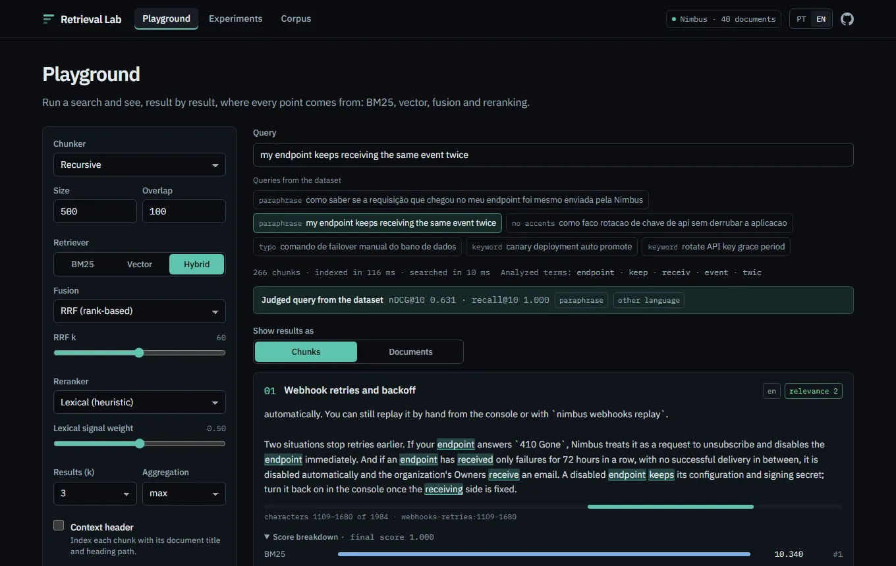
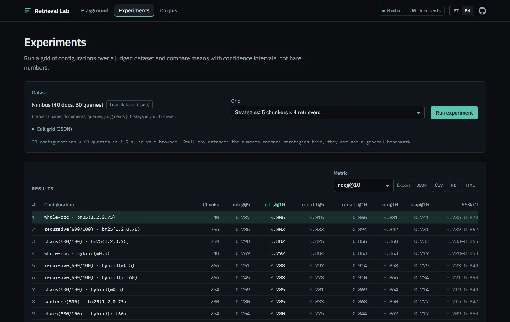
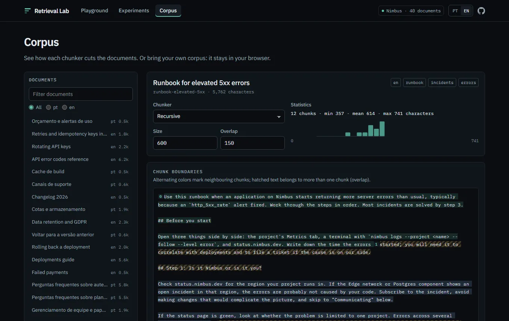
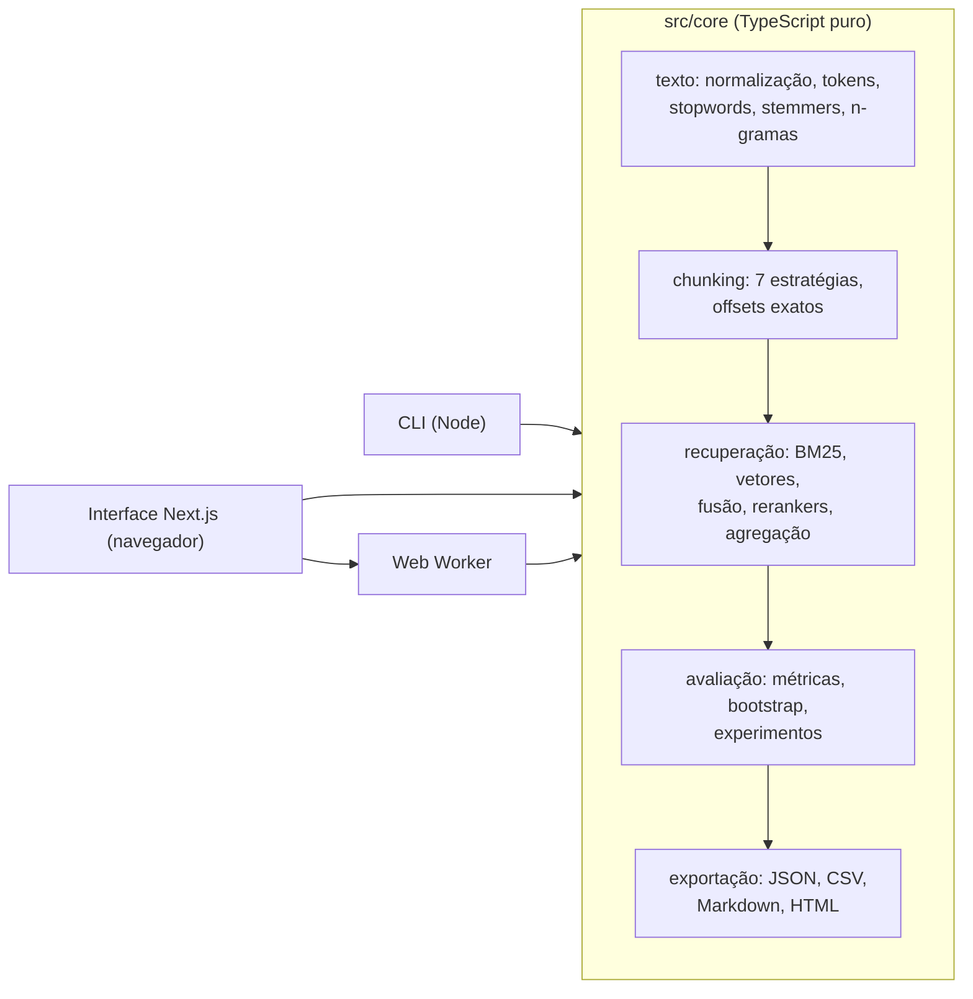

# Retrieval Lab

**Laboratório de busca e RAG: compare chunking, BM25, vetor e híbrido, e meça com recall@k, MRR e nDCG. Roda 100% offline, sem chave de API.**

[English](README.md) · [Arquitetura](docs/ARCHITECTURE.md) · MIT

A maioria das demos de RAG é uma caixa de chat. Só que a qualidade da resposta é decidida, em grande
parte, um passo antes: na **recuperação**, ou seja, em quais chunks chegam ao modelo. O Retrieval Lab
serve para medir esse passo. Ele corta um corpus de vários jeitos, recupera com BM25, vetores ou os
dois, reordena e avalia cada configuração contra julgamentos de relevância graduados, com intervalos
de confiança e um teste pareado, para que uma diferença de 0,01 não seja confundida com avanço.

Tudo é um núcleo em TypeScript puro, sem dependências de runtime além do `zod`, usado por uma CLI e
por um app Next.js que faz todo o cálculo no seu navegador (sem backend, sem banco, sem chave de API).

| Playground                                                                             | Experimentos                                                                     | Corpus                                                 |
| -------------------------------------------------------------------------------------- | -------------------------------------------------------------------------------- | ------------------------------------------------------ |
|  |  |  |

## O que tem dentro

- **Análise de texto**: normalização Unicode NFKD (remove acentos), tokenizador com offsets exatos,
  stopwords em pt-BR e en, stemmers leves por remoção de sufixos para as duas línguas, n-gramas de
  palavras e de caracteres, separador de sentenças.
- **Chunkers** (todos devolvem offsets `start`/`end` exatos, testados por propriedade): documento
  inteiro, tamanho fixo em caracteres, tamanho fixo em tokens, por sentenças, por parágrafos, por
  títulos de markdown (com a trilha de títulos) e um divisor recursivo no estilo LangChain, todos com
  sobreposição opcional.
- **Recuperadores**: Okapi BM25 sobre índice invertido (`k1` e `b` configuráveis); busca vetorial exata
  por cosseno atrás de uma interface `Embedder`; um `HashingEmbedder` determinístico e sem treino
  (feature hashing com sinal sobre uni/bigramas de palavras e trigramas de caracteres), para tudo
  funcionar offline; e um `OpenAICompatibleEmbedder` para qualquer endpoint `/embeddings` (OpenAI,
  Ollama, LM Studio, vLLM...).
- **Híbrido e reranking**: Reciprocal Rank Fusion, fusão ponderada min-max, MMR para diversidade e um
  reranker léxico transparente (cobertura e proximidade dos termos da consulta). Os rerankers são
  heurísticas, não cross-encoders neurais, e isso está dito em todo lugar onde aparecem.
- **Avaliação**: datasets validados com zod e julgamentos graduados; recall@k, precision@k, hit@k, MRR,
  MAP e nDCG@k graduado; intervalos de confiança por bootstrap de percentis; bootstrap pareado para
  responder "B é melhor que A?"; diagnóstico por consulta (por que falhou); exportação em JSON, CSV,
  Markdown e relatório HTML autocontido.
- **Dataset incluído**: um corpus bilíngue original sobre a Nimbus, uma plataforma de desenvolvimento
  fictícia: 40 documentos (20 em pt-BR, 20 em en, de 500 a 6.200 caracteres, alguns runbooks longos com
  títulos) e 60 consultas com julgamentos graduados, incluindo paráfrases, consultas sem acento,
  consultas no outro idioma, erros de digitação e perguntas que pedem vários documentos. Veja
  [datasets/nimbus](datasets/nimbus/README.md).
- **CLI**: `search`, `eval` e `chunk`, com tabelas legíveis, `--json`, códigos de saída e `--help`.
- **Interface web** (pt-BR e en, estado na URL):
  - _Playground_: busque num corpus, ajuste a estratégia e veja os termos destacados, onde cada chunk
    fica no documento e, para cada resultado, a composição BM25 / vetor / fusão / rerank e as mudanças
    de posição.
  - _Experimentos_: rode uma grade num Web Worker, compare configurações em qualquer métrica com IC,
    pergunte "B é melhor que A?", quebre os resultados por tipo de consulta e investigue um mapa de
    calor consulta por consulta.
  - _Corpus_: navegue pelos documentos e veja exatamente onde cada chunker corta (sobreposições
    hachuradas), ou traga seu corpus colando texto ou carregando `.md`, `.txt`, `.jsonl` ou um dataset
    `.json`. Nada sai do navegador.

## Como rodar

Precisa de Node 22 ou mais novo.

```bash
npm install --no-audit --no-fund
npm run dev                # http://localhost:3120 (redireciona para /pt-BR; /en em inglês)
```

CLI (via `tsx`, sem etapa de build):

```bash
npm run rlab -- search "verify webhook signature" --retriever hybrid --k 5
npm run rlab -- search "como faco rotacao de chave" --retriever bm25 --rerank lexical --chunker markdown
npm run rlab -- chunk datasets/nimbus/docs/deployments-guide.md --chunker recursive --size 600 --overlap 100 --preview
npm run rlab -- eval --dataset datasets/nimbus.json --grid datasets/grid.default.json --out reports/nimbus --format md,json,csv,html
npm run experiment         # o mesmo eval, com a grade padrão
npm run rlab -- --help
```

`--corpus` aceita uma pasta com `.md`/`.txt`, um arquivo `.md`/`.txt`/`.jsonl` ou um dataset `.json`.
Códigos de saída: 0 sucesso, 1 erro de execução, 2 uso inválido.

## Resultados no dataset incluído

Gerado por `npm run experiment` (grade padrão: 5 chunkers × 4 recuperadores, métricas por documento, agregação por máximo, 2.000 reamostragens de bootstrap, semente 42). **Esses números vêm do pequeno dataset de brinquedo incluído. Não são um benchmark geral** e mudariam com outros documentos, consultas ou julgamentos.

| #   | configuration                         | chunks | ndcg@5 |    **ndcg@10** (95% CI) | recall@5 | recall@10 | mrr@10 | map@10 |
| --- | ------------------------------------- | -----: | -----: | ----------------------: | -------: | --------: | -----: | -----: |
| 1   | whole-doc · bm25(1.2,0.75)            |     40 |  0.787 | **0.806** (0.735–0.870) |    0.815 |     0.865 |  0.881 |  0.741 |
| 2   | recursive(500/100) · bm25(1.2,0.75)   |    266 |  0.785 | **0.803** (0.739–0.862) |    0.833 |     0.894 |  0.842 |  0.731 |
| 3   | chars(500/100) · bm25(1.2,0.75)       |    254 |  0.790 | **0.802** (0.733–0.865) |    0.825 |     0.856 |  0.860 |  0.733 |
| 4   | whole-doc · hybrid(w0.5)              |     40 |  0.769 | **0.792** (0.720–0.858) |    0.804 |     0.853 |  0.863 |  0.719 |
| 5   | recursive(500/100) · hybrid(w0.5)     |    266 |  0.751 | **0.788** (0.723–0.849) |    0.797 |     0.914 |  0.858 |  0.729 |
| 6   | recursive(500/100) · hybrid(rrf60)    |    266 |  0.745 | **0.788** (0.721–0.850) |    0.778 |     0.910 |  0.866 |  0.734 |
| 7   | chars(500/100) · hybrid(w0.5)         |    254 |  0.759 | **0.785** (0.719–0.849) |    0.781 |     0.869 |  0.864 |  0.714 |
| 8   | sentence(500) · bm25(1.2,0.75)        |    230 |  0.780 | **0.785** (0.715–0.847) |    0.833 |     0.868 |  0.850 |  0.727 |
| 9   | chars(500/100) · hybrid(rrf60)        |    254 |  0.754 | **0.780** (0.709–0.850) |    0.775 |     0.844 |  0.862 |  0.717 |
| 10  | whole-doc · hybrid(rrf60)             |     40 |  0.751 | **0.777** (0.710–0.841) |    0.787 |     0.869 |  0.866 |  0.721 |
| 11  | sentence(500) · hybrid(w0.5)          |    230 |  0.745 | **0.771** (0.700–0.840) |    0.789 |     0.872 |  0.865 |  0.707 |
| 12  | sentence(500) · hybrid(rrf60)         |    230 |  0.727 | **0.766** (0.694–0.834) |    0.750 |     0.879 |  0.871 |  0.712 |
| 13  | markdown(800) · bm25(1.2,0.75)        |    250 |  0.755 | **0.764** (0.694–0.832) |    0.833 |     0.872 |  0.815 |  0.697 |
| 14  | markdown(800) · hybrid(rrf60)         |    250 |  0.720 | **0.751** (0.684–0.814) |    0.793 |     0.883 |  0.839 |  0.695 |
| 15  | markdown(800) · hybrid(w0.5)          |    250 |  0.731 | **0.747** (0.675–0.814) |    0.807 |     0.862 |  0.835 |  0.687 |
| 16  | chars(500/100) · vector(hash1024)     |    254 |  0.717 | **0.744** (0.667–0.812) |    0.750 |     0.831 |  0.833 |  0.673 |
| 17  | recursive(500/100) · vector(hash1024) |    266 |  0.708 | **0.730** (0.649–0.803) |    0.753 |     0.821 |  0.813 |  0.666 |
| 18  | sentence(500) · vector(hash1024)      |    230 |  0.703 | **0.724** (0.642–0.804) |    0.725 |     0.790 |  0.849 |  0.667 |
| 19  | whole-doc · vector(hash1024)          |     40 |  0.690 | **0.714** (0.640–0.785) |    0.737 |     0.804 |  0.818 |  0.637 |
| 20  | markdown(800) · vector(hash1024)      |    250 |  0.668 | **0.692** (0.615–0.765) |    0.729 |     0.808 |  0.800 |  0.633 |

Bootstrap pareado sobre nDCG@10 (10.000 reamostragens), todos com chunks `recursive(500/100)` salvo indicação:

| Comparação (B contra A)                                | Δ nDCG@10 |          IC 95% | B venceu / perdeu / empatou | Veredito     |
| ------------------------------------------------------ | --------: | --------------: | --------------------------: | ------------ |
| BM25 doc. inteiro contra BM25 recursivo (1º contra 2º) |    +0,003 | [−0,035; 0,041] |                16 / 17 / 27 | ruído        |
| BM25 contra vetor de hashing                           |    +0,074 |  [0,013; 0,138] |                24 / 15 / 21 | se distingue |
| híbrido RRF contra BM25                                |    −0,015 | [−0,056; 0,023] |                17 / 17 / 26 | ruído        |
| recursive(500/100) contra markdown(800), ambos BM25    |    +0,040 |  [0,007; 0,076] |                 18 / 9 / 33 | se distingue |

nDCG@10 por tipo de consulta (uma consulta pode ter várias tags):

| Tipo de consulta (n)  | BM25 | vetor de hashing | híbrido RRF | híbrido ponderado |
| --------------------- | ---: | ---------------: | ----------: | ----------------: |
| palavra-chave (18)    | 0,94 |             0,85 |        0,95 |              0,92 |
| paráfrase (17)        | 0,60 |             0,60 |        0,63 |              0,62 |
| outro idioma (10)     | 0,64 |             0,41 |        0,54 |              0,56 |
| doc. longo (10)       | 0,87 |             0,89 |        0,87 |              0,87 |
| sem acentos (8)       | 0,78 |             0,64 |        0,72 |              0,75 |
| vários docs (4)       | 0,92 |             0,89 |        0,89 |              0,90 |
| morfologia (3)        | 0,86 |             0,97 |        0,87 |              0,87 |
| erro de digitação (3) | 0,83 |             0,62 |        0,78 |              0,81 |

Como ler isso com honestidade:

- Neste corpus **o BM25 é difícil de bater**. As melhores configurações ficam a cerca de 0,01 de nDCG@10 umas das outras e os intervalos se sobrepõem bastante; o teste pareado não separa a primeira da segunda.
- O embedder de hashing sozinho é mensuravelmente pior que o BM25 aqui (o IC da diferença exclui zero). Ele é um modelo léxico/de subpalavras, então isso é esperado, não um veredito sobre recuperação densa com um modelo de verdade.
- A fusão híbrida não melhora o nDCG@10 na média, embora alcance o maior recall@10 (0,914 / 0,910). Paráfrases ficam perto de 0,6 em todos os métodos: nenhum entende significado, que é justamente a lacuna que um modelo de embeddings semântico resolveria.
- O chunker de markdown com 800 caracteres perde para o divisor recursivo com sobreposição nestes dados, por uma margem que o teste pareado separa do ruído.
- Grupos com 3 ou 4 consultas (erro de digitação, morfologia, vários docs) são pequenos demais para qualquer conclusão.

## Arquitetura



O núcleo não importa React, DOM nem módulos do Node (uma regra do ESLint garante isso), então o mesmo
código roda nos testes, na CLI e no navegador. Mais detalhes em
[docs/ARCHITECTURE.md](docs/ARCHITECTURE.md), inclusive como adicionar um chunker, um recuperador ou
uma métrica.

## Decisões de projeto e trade-offs

- **Medir documentos, não chunks.** As consultas são julgadas por documento, e as pontuações dos chunks
  são agregadas por documento (`max` por padrão; `sum` e `mean` disponíveis) antes de calcular as
  métricas. É isso que torna um chunker de 500 caracteres comparável com a recuperação do documento
  inteiro. A recuperação vai mais fundo que `k` (`max(5k, 50)` chunks) antes de agregar, para que um
  documento não suma porque os próprios chunks se empurraram para fora da lista.
- **Intervalo de confiança e teste pareado por padrão.** Com 60 consultas, a maior parte das diferenças
  entre configurações razoáveis é ruído. Mostrar um IC por bootstrap (com semente fixa) ao lado de cada
  média, e testar pares sobre as diferenças por consulta, impede a ferramenta de vender demais os
  próprios resultados.
- **Chunks são fatias exatas.** Todo chunker devolve offsets `[start, end)` com
  `source.slice(start, end) === chunk.text`. Contexto como a trilha de títulos entra só no texto
  indexado (`contextHeaders`), nunca no chunk, então o destaque e a visualização de fronteiras continuam
  exatos.
- **Um embedder offline que é honesto sobre o que é.** O embedder de hashing não precisa de modelo nem
  de rede e é determinístico, o que deixa os testes e a demo pública reproduzíveis. Ele captura
  sobreposição de subpalavras (acentos, erros de digitação, flexões, alguns cognatos), não significado.
  O caminho para um modelo de verdade é o `OpenAICompatibleEmbedder`, atrás da mesma interface.
- **Busca vetorial exata.** Um índice plano custa O(n · dims) por consulta. É a escolha certa até
  dezenas de milhares de chunks (veja o benchmark); um índice ANN entraria atrás da mesma assinatura
  de `search`.
- **Idiomas.** Cada documento é reduzido com o stemmer do próprio idioma; consultas curtas raramente
  revelam o delas, então, quando a detecção não é conclusiva, a consulta recebe o radical em português
  e em inglês. Os stemmers são heurísticas leves e legíveis, não ports do Snowball: o que importa para
  a recuperação é que uma palavra sempre vire o mesmo radical, e os testes fixam tanto radicais exatos
  quanto famílias que precisam convergir.
- **Fusão por posição como padrão.** Pontuações do BM25 e similaridades de cosseno estão em escalas
  diferentes. O RRF só usa as posições e não precisa de ajuste; a fusão ponderada min-max está incluída
  para que a diferença seja medida, não afirmada.
- **Sem backend.** A demo é estática: todo o cálculo roda no cliente (experimentos num Web Worker). Nada
  do que alguém cola ou carrega é enviado.

## Usando um modelo de embeddings de verdade

A interface web usa só o embedder de hashing. A CLI e o núcleo chamam qualquer endpoint `/embeddings`
compatível com a OpenAI:

```bash
# Modelo local com Ollama (sem chave)
npm run rlab -- search "rotate api key" --retriever hybrid --embedder openai \
  --embed-url http://localhost:11434/v1 --embed-model nomic-embed-text

# API hospedada: a chave vem de RLAB_EMBEDDINGS_API_KEY ou OPENAI_API_KEY
npm run rlab -- search "rotate api key" --retriever vector --embedder openai \
  --embed-url https://api.openai.com/v1 --embed-model text-embedding-3-small
```

Num arquivo de grade, use `{ "type": "vector", "embedder": { "type": "openai", "baseUrl": "...", "model": "..." } }`.
A chave só vai no cabeçalho `Authorization`; nunca é gravada em configuração, resultados ou mensagens
de erro. Esse caminho é coberto por testes unitários com `fetch` simulado; ele não foi rodado contra uma
API real para este README.

## Benchmark

`npm run bench` gera um corpus sintético com semente fixa (vocabulário com distribuição tipo Zipf),
corta com `recursive(500/100)` e mede o tempo de indexação e a latência por consulta em 200 consultas
(top 10). Medido uma vez num Intel Xeon E5-2640 v3 (2,6 GHz, 16 threads), 16 GB de RAM, Windows 11,
Node 24.12. Seus números vão ser outros; rode na sua máquina.

|  docs | chunks | caracteres | chunking | índice BM25 | embeddings (hashing) | BM25 p50 / p95 | vetor p50 / p95 | híbrido p50 / p95 |
| ----: | -----: | ---------: | -------: | ----------: | -------------------: | -------------: | --------------: | ----------------: |
| 1,000 |  4,091 |       1.3M |    12 ms |      278 ms |             1,018 ms | 0.40 / 0.95 ms |  7.65 / 8.49 ms |    8.82 / 9.94 ms |
| 5,000 | 20,601 |       6.8M |    43 ms |    1,229 ms |             5,229 ms | 2.40 / 5.48 ms |      37 / 40 ms |        42 / 46 ms |

O tempo do BM25 cresce com o tamanho das listas de postings; a busca vetorial é linear em chunks ×
dimensões, por isso a busca exata funciona bem nesse tamanho e um índice ANN seria o próximo passo além
dele.

## Qualidade

- TypeScript `strict` com `noUncheckedIndexedAccess`; nenhum `any`; ESLint e Prettier limpos, com zero
  avisos.
- 321 testes no Vitest, em 17 arquivos: testes unitários por módulo, testes golden (BM25 e nDCG contra valores calculados à mão nos comentários) e testes por propriedade com `fast-check` (invariante de offsets para todo chunker, limites das métricas, propriedades do RRF, determinismo do embedder de hashing e do bootstrap com semente, ida e volta do estado na URL).
- Testes de fumaça com Playwright cobrem as três telas, a troca de idioma, o estado na URL, o corpus
  próprio e a ausência de rolagem horizontal em 375 px.
- CI (GitHub Actions): lint, typecheck, testes unitários e build, depois o job de e2e.

```bash
npm run lint && npm run typecheck && npm test && npm run build && npm run test:e2e
```

## Limitações

- **O dataset é de brinquedo.** São 40 documentos e 60 consultas, escritos por uma pessoa para este
  projeto. Serve para ver como as peças se comportam e exercitar a ferramenta, não para ranquear
  métodos de forma geral.
- **Os julgamentos são a opinião de uma pessoa**, feitos antes de rodar qualquer estratégia, e as
  consultas são sintéticas. Documentos não julgados contam como não relevantes, o que penaliza sistemas
  que encontram documentos relevantes que ninguém julgou.
- **Não há modelo semântico na configuração padrão.** O embedder de hashing não consegue casar
  paráfrases que não compartilham palavras nem subpalavras com a resposta; as notas medidas em
  paráfrases e consultas no outro idioma refletem isso.
- **Os stemmers e os rerankers são heurísticas.** Sem Snowball/RSLP, sem cross-encoder, sem recuperação
  esparsa aprendida.
- **Só busca exata**, em memória. Funciona para milhares de chunks, não para milhões.
- **O bootstrap pareado é uma aproximação** e o valor p é só um indicativo. Com muitas configurações,
  algumas diferenças "significativas" aparecem por acaso; não há correção para comparações múltiplas.

## Estrutura

```
src/core/      núcleo em TypeScript puro (texto, chunking, recuperação, avaliação, exportação)
src/cli/       CLI (Node): search, eval, chunk
app/, components/, lib/   interface web em Next.js 16 (App Router, React 19, Tailwind 4)
datasets/      fontes do corpus Nimbus, nimbus.json compilado, grade padrão
tests/         testes unitários, golden e por propriedade (Vitest)
e2e/           testes de fumaça (Playwright)
scripts/       build do dataset, benchmark, screenshots do README
```

## Licença

MIT © Cristhian Almeida
