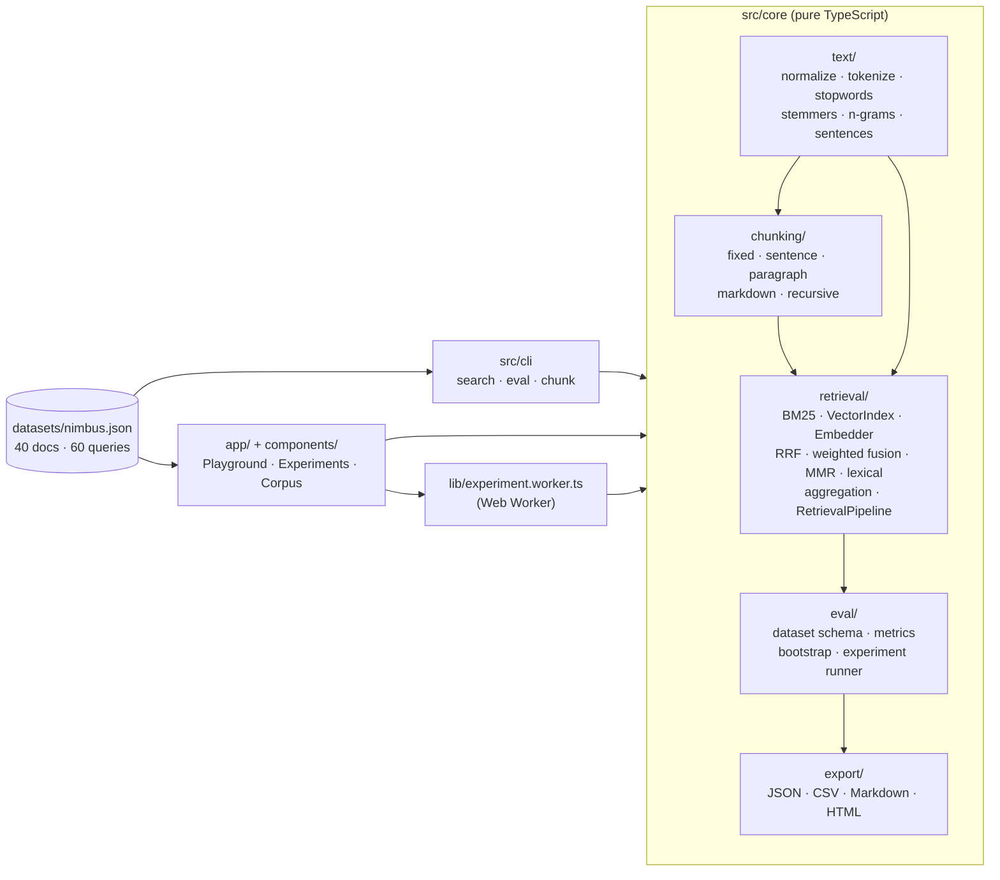

# Architecture

Retrieval Lab is one TypeScript core used by three front ends: unit tests, a Node CLI and a Next.js app
that runs everything in the browser. The core has no React, DOM or Node imports, and an ESLint rule
(`no-restricted-imports` on `src/core/**`) keeps it that way.

## Data flow of one search

1. **Chunking.** `createChunker(config)` turns each document into `Chunk`s with exact `[start, end)`
   offsets. The invariant `doc.text.slice(start, end) === chunk.text` is property-tested for every
   chunker. Whitespace is trimmed off the edges, so a chunk never starts or ends with a space.
2. **Index items.** `IndexCache.items()` turns chunks into what retrievers index. With
   `contextHeaders`, the document title and heading path are prepended to the indexed text (not to
   `chunk.text`, which stays an exact slice).
3. **Retrieval.** `Bm25Index` (inverted index, Lucene IDF) and/or `VectorIndex` (flat, exact cosine)
   return a ranked list of chunk ids, deeper than the final `k` (`max(5k, 50)` by default; hybrid
   candidates use `depth`, 100 by default).
4. **Fusion.** For hybrid retrieval, the two lists are merged with Reciprocal Rank Fusion or with
   weighted min-max fusion. Every hit keeps its rank in each input list, which is what the
   Playground's score breakdown shows.
5. **Reranking (optional).** MMR or the lexical heuristic reorders the top `depth` candidates. Final
   scores then become rank-derived so that document aggregation follows the new order.
6. **Aggregation.** Chunk hits become document hits (`max` by default, or `sum` / `mean`), because
   relevance is judged per document and that is the only level where different chunkers compare.

## Evaluation

`runExperiment(dataset, grid)` expands the grid (chunkers × retrievers × rerankers × context headers),
builds each pipeline through a shared `IndexCache` (so chunking, BM25 indexing and embeddings are done
once per distinct setting), runs every query and scores the document ranking against the graded
judgments. For each configuration it returns:

- mean recall@k, precision@k, hit@k, nDCG@k (every cutoff), MRR and MAP (largest cutoff);
- a 95% percentile-bootstrap confidence interval for each mean (seeded, so reruns are identical);
- per-query detail: metrics, top documents with their grades, where every relevant document ended up,
  and a diagnosis (`ok`, `ranked-low`, `outranked`, `vocabulary-mismatch`).

`compareConfigs(a, b, metric)` is a paired bootstrap on per-query differences: it reports the mean
delta, its 95% CI, a bootstrap p-value and wins/losses/ties, and calls a difference distinguishable
from noise only when the CI excludes zero.

## Web app

- Static: every route is prerendered (`/pt-BR`, `/en` and their `/experiments` and `/corpus`), and `/`
  redirects to `/pt-BR`. There is no API route, database or server-side computation.
- The Playground builds the pipeline on the main thread (a few milliseconds for the bundled corpus)
  and caches indexes per corpus, so changing a reranker or fusion parameter does not re-embed.
- Experiments run in a Web Worker (`lib/experiment.worker.ts`) so the page stays responsive; cancel
  terminates the worker.
- View state lives in the URL (`lib/url-state.ts`): only non-default values are written, and invalid
  values fall back to defaults instead of breaking the page.
- A user corpus lives in memory and in `sessionStorage` of the current tab. It is never uploaded.

## Extending

**A chunker.** Add a member to `ChunkerConfigSchema` in `src/core/config.ts`, implement a function that
returns `spansToChunks(doc, spans)` (so ids, trimming and the offset invariant come for free), wire it
in `createChunker` (`src/core/chunking/index.ts`) and add it to the property-test list in
`tests/chunking/chunking.property.test.ts`. TypeScript's exhaustive `switch` statements point at the
remaining places (`describeChunker`, the UI defaults in `lib/url-state.ts`).

**A retriever or embedder.** An embedder only needs `id` and `embed(texts): Promise<Float32Array[]>`
(see `src/core/retrieval/embedder.ts`); add its config to `EmbedderConfigSchema` and to
`createEmbedder`. A new retriever type goes in `RetrieverConfigSchema` and in
`RetrievalPipeline.search`, producing a ranked `Hit[]` and recording its `Signal` for each hit.

**A metric.** Add a pure function `(ranked, qrels, k) => number` in `src/core/eval/metrics.ts`, add its
key to `metricKeys` and `computeMetrics`, and add golden and property tests (bounds in `[0, 1]`,
behaviour on the ideal ranking). Every exporter and the UI pick it up from `metricKeys`.
